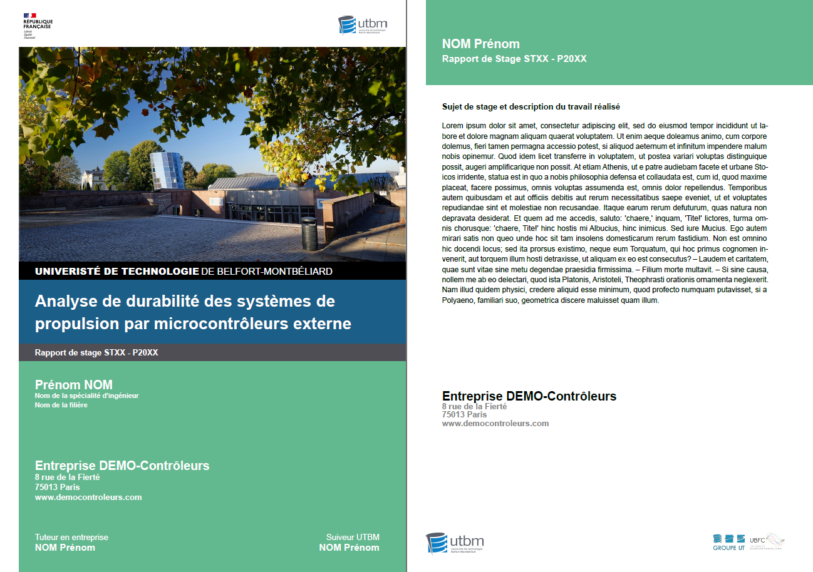

# UTBM-Internship-Report-Typst

UTBM Typst template for internship report.



## How to use it ?

Few steps are required :

- Download the `utbm.typ` file.
- Drop the template in your project
- Add the following line to your project :
    ```typst
    #import "/utbm.typ": cover, fourth-cover
    ```
- Use `cover` and `fourth-cover` respectively at the beginning and the end of your report.

## How to use the functions

### `cover` function

#### Parameters

| Parameter | type | Goal | Default Value |
| ----------- | ------ | ------ | --------------- |
| title   | string | Title of the report | "Analyse de durabilité des systèmes de propulsion par microcontrôleurs externe" |
| report-type | string | Type of UTBM internship | "STXX" |
| report-year | string | UTBM internship date    | "P20XX" |
| picture   | picture path | Cover picture | "assets/images/background.jpg" |
| student | dictionary(first-name: string, last-name: string, speciality: string, sector: string) | informations about the student | (first-name: "Prénom", last-name: "NOM", specialty: "Nom de la spécialité d'ingénieur", sector: "Nom de la filière") |
| company | dictionary(name: string, address: string, postal-code: string, city: string, website: string) | informations about the company | (name: "Entreprise DEMO-Contrôleurs", address: "8 rue de la Fierté", postal-code: "75013", city: "Paris", website: "www.democontroleurs.com") |
| tutor | dictionary(first-name: string, last-name: string) | Informations about the tutor in the company | (first-name: "Prénom", last-name: "NOM") |
| supervisor | dictionary(first-name: string, last-name: string) | Informations about the UTBM supervisor | (first-name: "Prénom", last-name: "NOM") |

#### example :

```typst
#cover(
  title: "My internship",
  report-type: "ST54",
  report-year: "P2024",
  picture: "assets/images/utbm_logo.png",
  student: (
    first-name: "Alexandre",
    last-name: "Viala",
    specialty: "Ingénieur en Informatique",
    sector: "Mondes Virtuels, UX & UI",
  ),
  company: (
    name: "Mon entreprise",
    address: "Adresse de mon entreprise",
    postal-code: "Code postal de mon entreprise",
    city: "Ville de mon entreprise",
    website: "www.site-web-de-mon-entreprise.com",
  ),
  tutor: (
    first-name: "Jean",
    last-name: "DUPOND",
  ),
  supervisor: (
    first-name: "Pierre",
    last-name: "SCHMIDT",
  )
)
```
<div align=center>
    
</div>

### `fourth-cover` function

#### Parameters

| Parameter | type | Goal | Default Value |
| ----------- | ------ | ------ | --------------- |
| subject   | string | Subject of your internship | "Sujet de stage et description du travail réalisé" |
| report-type | string | Type of UTBM internship | "STXX" |
| report-year | string | UTBM internship date    | "P20XX" |
| picture   | picture path | Cover picture | "assets/images/background.jpg" |
| student | dictionary(first-name: string, last-name: string) | Informations about the student | (first-name: "Prénom", last-name: "NOM") |
| company | dictionary(name: string, address: string, postal-code: string, city: string, website: string) | informations about the company | (name: "Entreprise DEMO-Contrôleurs", address: "8 rue de la Fierté", postal-code: "75013", city: "Paris", website: "www.democontroleurs.com") |
| abstract | none (body content) | Summary of your intership | none |

#### example :

```typst
#fourth-cover(
  subject: "Discovering new ways to fromat text",
  report-type: "ST54",
  report-year: "P2024",
  student: (
    first-name: "Alexandre",
    last-name: "Viala",
  ),
  company: (
    name: "Mon entreprise",
    address: "Adresse de mon entreprise",
    postal-code: "Code postal de mon entreprise",
    city: "Ville de mon entreprise",
    website: "www.site-web-de-mon-entreprise.com",
  ),
)[#lorem(248)]
```

<div align=center>
    
</div>

## Modifications

Feel free to modify the template as you wish. Typst is easy to learn if you already have some LaTeX and Markdown notions.


